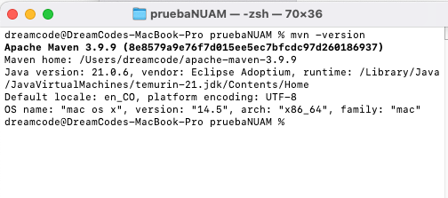
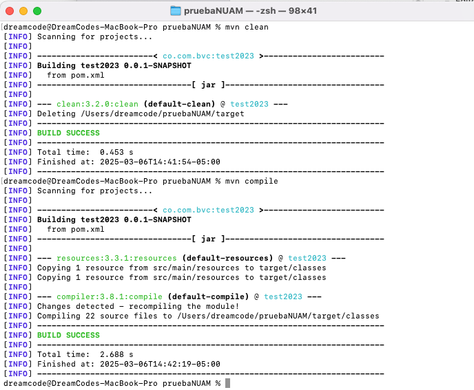
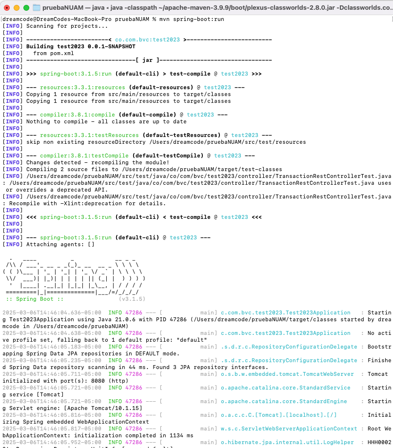
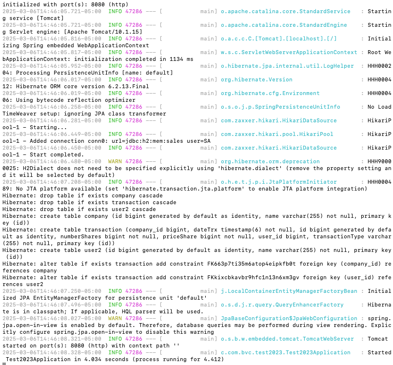

# PruebaNUAM
Repositorio java para prueba NUAM, no se requería creación de repo, sin embargo, se crea el repo para evidenciar los 
conocimientos en herramientas de versionamiento, en este caso especificamente GitHub, además, en este se ha subido el 
código proporcionado para la prueba, con algunos ajustes que permitieron correr el proyecto y corrección de alguna implementación 
de método, adicionalmente, se han añadido las funcionalidades requeridas en el enunciado enviado.

# Consideraciones Técnicas
El proyecto se ejecuta con Apache Maven 3.9.9, como se muestra a continuación:

Para levantar el servicio, se deben ejecutar los siguientes comandos (Localizado en la ruta raíz donde se encuentra 
el proyecto), como se muestra a continuación:

Después de ejecutar los comandos de "clean" y "compile" exitosamente, se debe ejecutar el comando "spring-boot:run" 
para levantar el servicio, como se muestra a continuación:

El servicio localmente queda expuesto en la ruta "http://localhost:8080", como se muestra en el log del servicio al
momento de levantarse (imagen anterior).

# Notas
- Para la prueba, se recibió una plantilla spring-boot con maven para las dependencias, sin embargo el servicio no me
iniciaba, para ello tuve que añadir dependencia del spring-boot-starter-parent en el pom.xml, puesto que,
estaba referenciado el parent, pero no se tenía la dependencia en la sección de dependencias.

- El método de actualizar compañía estaba mal implementado, puesto que, la respuesta mostraba el objeto modificado, pero
no se estaba persistiendo por debajo la entidad, así que al momento de volver a consultar todas las compañías, aparecía
el objeto sin las modificaciones, se corrige este comportamiento y se deja bien implementado.

- En cuanto a los paquetes del servicio, se logra evidenciar que la plantilla entregada carece de paquete "service", por
lo que consumen el repository directamente desde el controller, lo cuál es una mala práctica, se añade paquete service,
se corrigen los controller "userController" y "companyController" para que usen las clases service, además, el nuevo
controller "transactionController" se implementa de la misma forma.

- Se añade clases de test para el "transactionController" y el "transactionService", no se requería en el enunciado enviado,
sin embargo, se implementan como plus para evidenciar el conocimiento sobre el tema (creación de test unitarios con
JUnit y Mockito).

- Adicionalmente, se sube al repo el archivo "test_dev.postman_collection.json", el cuál contiene todas las operaciones
del Api, las que ya existían y las nuevas que se requerían construir.

- Se deja enlace de video de evidencia de algunas de las funcionalidades requeridas en el enunciado enviado:
  https://drive.google.com/file/d/113SUxb24T0akOzPT2M7oqQcH5EFDycoB/view?usp=drive_link